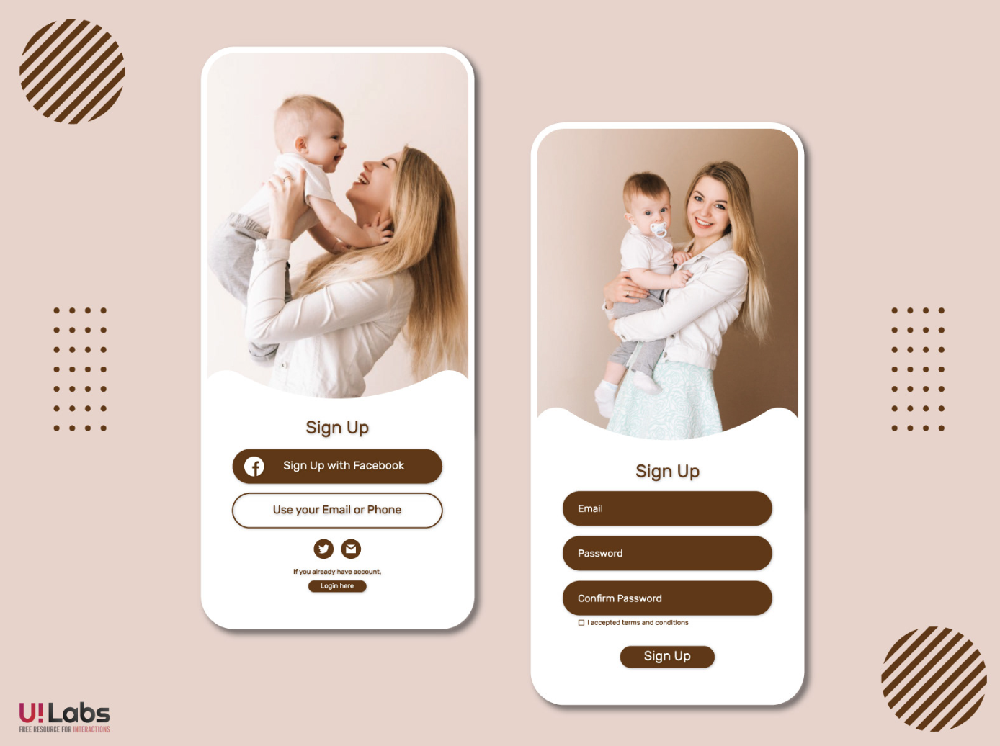
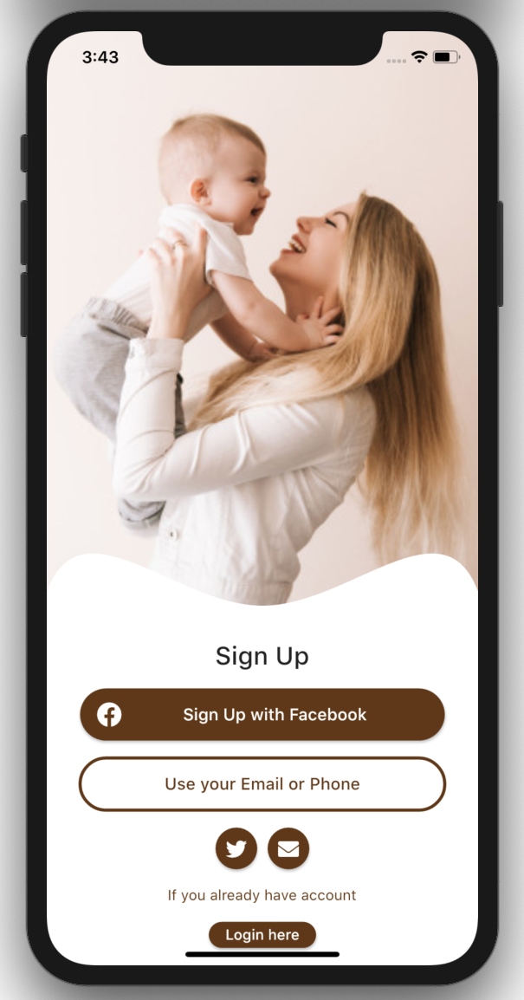
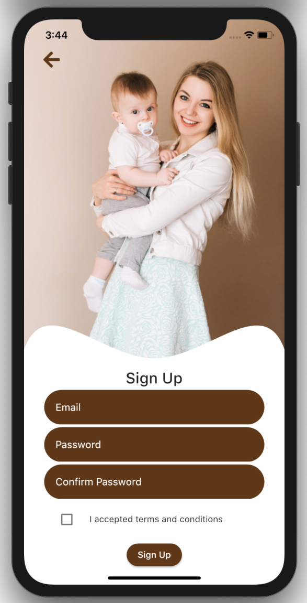

# Baby Care UI Concept - FLUTTER

  <a href="https://github.com/yibsonalexis/babycare_uiconcept_flutter">

Simple design taken from Behace
- [Baby-Care-UI-Concept](https://www.behance.net/gallery/98472971/Baby-Care-UI-Concept)

## Screenshot Original Design

## Made with FLUTTER

## Getting Started

This project is a starting point for a Flutter application.

A few resources to get you started if this is your first Flutter project:

- [Lab: Write your first Flutter app](https://flutter.dev/docs/get-started/codelab)
- [Cookbook: Useful Flutter samples](https://flutter.dev/docs/cookbook)
For help getting started with Flutter, view our
[online documentation](https://flutter.dev/docs), which offers tutorials,
samples, guidance on mobile development, and a full API reference.
